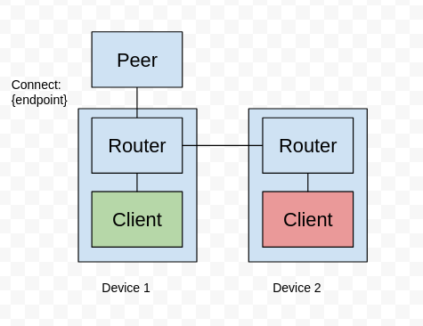

## cmds
router:
`docker compose -f router/compose.yaml up --build --abort-on-container-exit`

client:
`cd client && docker build -t subscriber . && docker run --init --network host subscriber`

peer:
`cd peer && python3 z_sensor.py`

### Architecture
